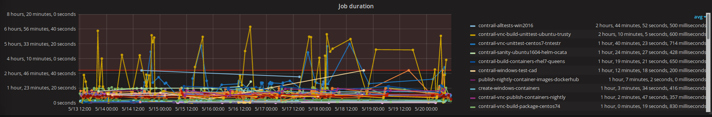

Troubleshooting Review Issues
=============================

As a developer you have access to a lot of information about the CI system. If your review is failing
and you don't think it's the code, you can take a look into our monitoring display to check the CI
system's health.

Grafana
-------

Grafana is a data visualization and monitoring dashboard. You can view the status of the various
defined alerts (is any node out of disk space and causing problems?), build statistics from CI and
nightly jobs (my job takes over 5 hours, is this normal? What's the average run time?) or unit
test statistics (what's the flakiness of a specific test case?).

The dashboard is available at http://148.251.5.91/grafana. Use the `demo` user with `demo` password
to log in (read-only user).

The below caption is an example chart which can be viewed in the `Build Statistics` dashboard.
It contains the average run times of all the jobs run by Zuul. You can filter out the jobs you want
to view by clicking on their names on the legend.

Job Logs
--------

You can view the output from any job which has run in CI. To do this go to the review page
e.g. https://review.opencontrail.org/#/c/51363/. There are a few things to verify initially.
Make sure to view the CI comments by pressing the `Toggle CI comments` button in the lower left
part of the page. Next, make sure that:

1. Zuul started / ran the jobs:

  There should be a Zuul comment stating `Starting check jobs` (or any other pipeline, depends on
  what you're looking for) after the last comment related to sending a new patchset (`Uploaded
  patch set N`).

  If instead there is any other message from Zuul (e.g. `This change depends on a change that failed
  to merge.`), then you'll need to figure out what the issue is, depending on the actual error.

2. Zuul finished running the jobs:

  There should be a Zuul comment stating `Build succeeded (check pipeline)` (might also be `failed`
  with any other pipeline name). Clicking on such comment will make it expand and show the links to
  the logs of the run jobs.

Click on any of the jobs links to view the logs:

1. The `ara/` directory will lead you to an ARA report, which is a well-formatted report from
  the Ansible playbooks, which were run during the job run. Each step's output can be viewed:

  * click on any of the playbooks associated '<N> tasks' hyperlink. This will expand the list of
    tasks run in that playbook. You can then click on any of the `Status` labels to see possible
    changes done by that task (or output; see caption below).

    .. image:: ../_static/user/monitoring/ara_report.png

2. The `job-output.json.gz` and `job-output.txt.gz` files both contain the full output from the
  job. This is what you would see when streaming logs from zuulv3.opencontrail.org. Ansible,
  compilation, network or any other errors will be output here.

3. The zuul-info contains a few files with some metadata about the job:

  * gitlog.builder.md - contains the git information about each project Zuul checked out for the job.
  * host-info.builder.yaml - Ansible facts gathered from the builder node
  * inventory.yaml - the inventory which Zuul uses to run the Ansible playbooks (contains information
    such as the build/buildset ID, IP of the builder node, target branch, change / patchset etc.)

